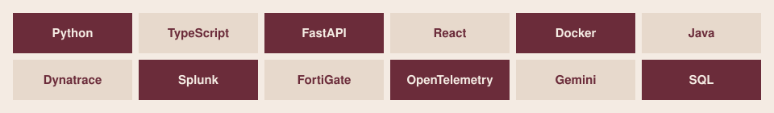

  <a href="https://www.linkedin.com/in/nourseen-tarek-1a9718399">LinkedIn</a>
  &nbsp;&#183;&nbsp;
  <a href="https://github.com/nourseen6">GitHub</a>
  &nbsp;&#183;&nbsp;
  <a href="mailto:nourkhfaga@gmail.com">Email</a>

## Work

<table>
<tr>
<td width="50%" valign="top">
<strong><a href="https://github.com/nourseen6/sentrix-core">SentriX Core</a></strong> 
Graduation project &#183; in progress  
A personal-safety wearable. On-device detection, then an alert over BLE to the phone, or over cellular when the phone is away. Security architecture is in this repository. Hardware is still prototyping.
</td>
<td width="50%" valign="top">
<strong><a href="https://github.com/nourseen6/incident-commander">Incident Commander</a></strong> 
With Shahesta Salama &#183; 1st place, student track, ITIDA DevOps Day 2026  
Competing explanations of an incident. Belief updates as evidence arrives, and the next check is chosen by expected information gain. Actions stay reversible and policy-gated.
</td>
</tr>
<tr>
<td width="50%" valign="top">
<strong><a href="https://github.com/nourseen6/goldenrod">Goldenrod</a></strong> 
Agentic Cinema hackathon  
Checks a script revision against facts and production decisions already logged. 
Python &#183; Gemini &#183; ClickHouse &#183; Cloud Run
</td>
<td width="50%" valign="top">
<strong>Intrusion detection pipeline</strong> 
Python  
Ingestion, cleaning, and feature engineering on network traffic, then supervised classification of benign and malicious flows.
</td>
</tr>
</table>

**[Fortinet device management](https://github.com/nourseen6/Fortinet-Device-Management-with-FortiManager)** &#183; FortiGate through FortiManager: policies, configuration, and troubleshooting.

## Focus

<table>
<tr>
<td width="50%" valign="top">
<strong>Security and networks</strong> 
FortiGate &#183; FortiManager &#183; IPS &#183; VLANs &#183; NAT &#183; site-to-site VPN &#183; ACLs
</td>
<td width="50%" valign="top">
<strong>Observability and systems</strong> 
Dynatrace &#183; Splunk &#183; log analytics &#183; distributed tracing &#183; alerting &#183; containers
</td>
</tr>
</table>

## Tools

## Experience

**EJADA** &#183; Observability intern &#183; July 2026, one month  
Splunk and Dynatrace for application and infrastructure monitoring, log analytics, and distributed tracing.

**DEPI / NTI** &#183; Fortinet track &#183; Dec 2024 – Jun 2025  
FortiGate labs: policies, IPS, VLAN segmentation, NAT, and site-to-site VPN, plus the CCNA curriculum. FortiManager for device configuration and policy deployment.

B.Sc. Computer Science &#183; Alryada University &#183; expected June 2027

## GitHub

  
  

  <a href="https://www.linkedin.com/in/nourseen-tarek-1a9718399">LinkedIn</a>
  &nbsp;&#183;&nbsp;
  <a href="https://github.com/nourseen6">GitHub</a>
  &nbsp;&#183;&nbsp;
  <a href="mailto:nourkhfaga@gmail.com">nourkhfaga@gmail.com</a>

