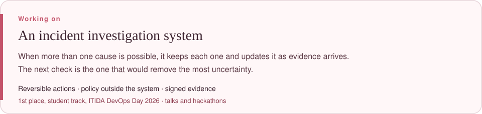

  

  <a href="https://github.com/nourseen6/sentrix-core">SentriX Core</a>
  &nbsp;&#183;&nbsp;
  <a href="https://www.linkedin.com/in/nourseen-tarek-1a9718399">LinkedIn</a>
  &nbsp;&#183;&nbsp;
  <a href="mailto:nourkhfaga@gmail.com">Email</a>

## Skills

  
  

