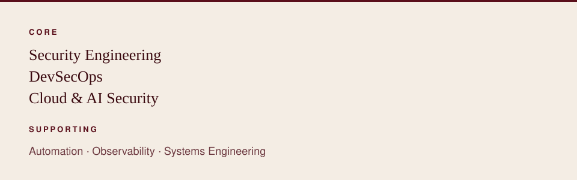

  <a href="https://www.linkedin.com/in/nourseen-tarek-1a9718399">LinkedIn</a>
  &nbsp;&#183;&nbsp;
  <a href="#projects">Projects</a>
  &nbsp;&#183;&nbsp;
  <a href="#contact">Contact</a>

## Selected work

**01 / Incident Commander**  
Evidence-driven incident investigation

An investigation system that maintains competing hypotheses, updates belief as evidence arrives, and selects the next check using expected information gain. Built with Shahesta Salama.

Python · FastAPI · TypeScript · React  
Docker · OpenTelemetry · OPA / Rego

[Repository](https://github.com/nourseen6/incident-commander)

**02 / SentriX Core**  
Secure edge-AI personal safety system

Graduation project, in progress. It brings together edge AI, connectivity, mobile and cloud components, and security architecture. This repository holds the design and the security plan.

Edge AI · Security architecture · BLE / cellular  
Mobile · Cloud

[Repository](https://github.com/nourseen6/sentrix-core)

**03 / Goldenrod**  
Agentic cinema intelligence

An AI-assisted check of script revisions against the production's established facts and logged decisions. Built for the Agentic Cinema hackathon.

Python · Gemini · ClickHouse · Cloud Run

[Repository](https://github.com/nourseen6/goldenrod)

## Background

Computer Science senior at Alryada University.

Cybersecurity and networking background, with work across network security, firewall engineering, secure infrastructure, intrusion detection, and observability.

Worked with Dynatrace and Splunk, monitoring applications and infrastructure.

## Technical areas

<table>
<tr>
<td width="28%" valign="top"><strong>Security</strong></td>
<td valign="top">Network security &#183; Firewalls &#183; IDS / IPS &#183; Threat modeling &#183; OPA / Rego &#183; Security requirements</td>
</tr>
<tr>
<td valign="top"><strong>Systems</strong></td>
<td valign="top">Docker &#183; FastAPI &#183; OpenTelemetry &#183; Dynatrace &#183; Splunk &#183; Cloud Run</td>
</tr>
<tr>
<td valign="top"><strong>AI and automation</strong></td>
<td valign="top">AI security &#183; Bayesian reasoning &#183; Information gain &#183; Workflow automation</td>
</tr>
<tr>
<td valign="top"><strong>Development</strong></td>
<td valign="top">Python &#183; TypeScript &#183; React</td>
</tr>
</table>

## Experience

**EJADA** · Observability intern · 2026

Dynatrace · Splunk · Application and infrastructure monitoring

**DEPI** · Fortinet cybersecurity training

Network security · Firewall fundamentals

## Education

**Alryada University**

B.Sc. Computer Science · Senior · 2026

## Links

[LinkedIn](https://www.linkedin.com/in/nourseen-tarek-1a9718399) · [GitHub](https://github.com/nourseen6) · [nourkhfaga@gmail.com](mailto:nourkhfaga@gmail.com)
