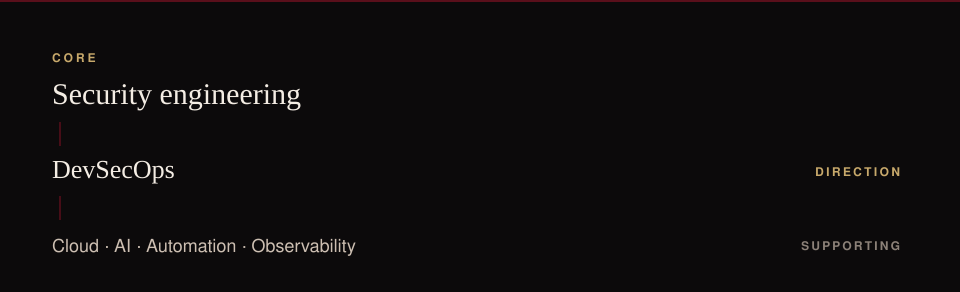

  <a href="https://www.linkedin.com/in/nourseen-tarek-1a9718399">LinkedIn</a>
  &nbsp;·&nbsp;
  <a href="#projects">Projects</a>
  &nbsp;·&nbsp;
  <a href="#contact">Contact</a>

## 02 — What I'm building toward

Security engineering is the center of the work. DevSecOps is the direction I am building toward. Cloud, AI, automation, and observability are the areas I work across on the way there.

## 03 — Currently building

<table>
<tr>
<td width="50%" valign="top">
  
<strong>SentriX Core</strong> 
Secure edge-AI personal safety system  
Graduation project · In progress  
A personal-safety path: on-device detection, BLE or cellular connectivity, a mobile app, cloud, and security across that path. This repository is the design and the security plan. The system is still being built.  
Edge AI · Security architecture · Connectivity · Mobile · Cloud  
<a href="https://github.com/nourseen6/sentrix-core">Repository</a>
</td>
<td width="50%" valign="top">
  
<strong>Incident Commander</strong> 
Evidence-driven incident investigation  
With Shahesta Salama · Hackathon · Prize  
When more than one explanation fits, the system keeps competing hypotheses, updates belief as evidence arrives, and chooses the next check by expected information gain. Each action is gated by an Open Policy Agent policy outside the agent.  
Python · FastAPI · TypeScript · React · Docker · OpenTelemetry · OPA / Rego  
<a href="https://github.com/nourseen6/incident-commander">Repository</a>
</td>
</tr>
</table>

## 04 — Selected work

**[Goldenrod](https://github.com/nourseen6/goldenrod)** · Agentic Cinema hackathon

A check that runs when a film call sheet is issued. It compares the new script revision with facts already established and decisions already logged, then ranks what those changes broke by what has been paid for.

Python · Gemini · ClickHouse · Cloud Run

**[Fortinet device management](https://github.com/nourseen6/Fortinet-Device-Management-with-FortiManager)**

Managing FortiGate devices through FortiManager: configuration, security policies, and troubleshooting.

FortiGate · FortiManager

## 05 — How I work

I want to see the whole system: how it runs, how it fails, and what evidence it leaves. Security belongs inside that path.

| Security | Systems and infrastructure | AI and automation |
|---|---|---|
| Policy, threat modeling, and the requirements a system has to meet. | Services, telemetry, and how applications and infrastructure behave. | Investigation logic and checks that run as part of the workflow. |

## 06 — Technical areas

<table>
<tr>
<td width="28%" valign="top"><strong>Security</strong></td>
<td valign="top">Network security · Firewalls · IDS / IPS · Threat modeling · OPA / Rego · Security requirements</td>
</tr>
<tr>
<td valign="top"><strong>Systems and operations</strong></td>
<td valign="top">Docker · FastAPI · OpenTelemetry · Dynatrace · Splunk · Cloud Run</td>
</tr>
<tr>
<td valign="top"><strong>AI and automation</strong></td>
<td valign="top">Bayesian reasoning · Information gain · Gemini · Workflow checks</td>
</tr>
<tr>
<td valign="top"><strong>Development</strong></td>
<td valign="top">Python · TypeScript · React</td>
</tr>
</table>

## 07 — Experience

**EJADA** · Summer internship, 2026

Observability. Dynatrace, Splunk, and monitoring of applications and infrastructure.

**DEPI** · Fortinet cybersecurity training

Network security and firewall fundamentals.

## 08 — Education

**Alryada University**

B.Sc. Computer Science

Senior · graduating this year

## 09 — Connect

[LinkedIn](https://www.linkedin.com/in/nourseen-tarek-1a9718399) · [GitHub](https://github.com/nourseen6) · [nourkhfaga@gmail.com](mailto:nourkhfaga@gmail.com)
