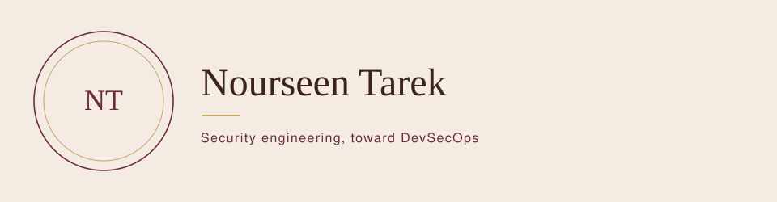

<em>Security belongs inside the system.</em>

  <a href="https://www.linkedin.com/in/nourseen-tarek-1a9718399">LinkedIn</a>
  &nbsp;&#183;&nbsp;
  <a href="https://github.com/nourseen6">GitHub</a>
  &nbsp;&#183;&nbsp;
  <a href="mailto:nourkhfaga@gmail.com">Email</a>

<table>
<tr>
<td width="22%"><strong>Building</strong></td>
<td><a href="https://github.com/nourseen6/sentrix-core">SentriX Core</a> and <a href="https://github.com/nourseen6/incident-commander">Incident Commander</a></td>
</tr>
<tr>
<td><strong>Direction</strong></td>
<td>DevSecOps</td>
</tr>
<tr>
<td><strong>Across</strong></td>
<td>Cloud &#183; AI &#183; Automation &#183; Observability</td>
</tr>
</table>

## Work

**[SentriX Core](https://github.com/nourseen6/sentrix-core)**  
Graduation project, in progress. A personal-safety path: edge AI, connectivity, mobile, cloud, and the security plan.

**[Incident Commander](https://github.com/nourseen6/incident-commander)**  
With Shahesta Salama. Competing hypotheses, then the next check by expected information gain. Hackathon, prize winner.

**[Goldenrod](https://github.com/nourseen6/goldenrod)**  
A script revision, checked against facts and decisions already logged.

**[Fortinet device management](https://github.com/nourseen6/Fortinet-Device-Management-with-FortiManager)**  
FortiGate through FortiManager: configuration, policies, and troubleshooting.

## Experience

**EJADA** &#183; Observability intern, 2026 &#183; Dynatrace, Splunk, application and infrastructure monitoring

**DEPI** &#183; Fortinet cybersecurity training &#183; network security and firewalls

## Tools

  
  
  
  
  
  

  
  
  
  

## GitHub

  
  

  <a href="https://www.linkedin.com/in/nourseen-tarek-1a9718399">LinkedIn</a>
  &nbsp;&#183;&nbsp;
  <a href="https://github.com/nourseen6">GitHub</a>
  &nbsp;&#183;&nbsp;
  <a href="mailto:nourkhfaga@gmail.com">nourkhfaga@gmail.com</a>

