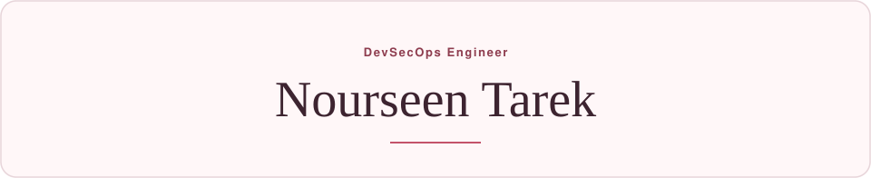

  

## Skills

  
  
  
  
  

  
  
  
  
  
  

  
  
  
  
  
  

  
  
  
  
  
  

  
  
  

  
  
  
  

  
  
  
  

## Projects

| Project | |
| --- | --- |
| [Incident Commander](https://github.com/nourseen6/incident-commander) | Competing explanations of an incident, updated as evidence arrives. The next check is chosen by information gain. 1st place, student track, ITIDA DevOps Day 2026. [Presentation](https://github.com/nourseen6/incident-commander/blob/main/demo/Incident_Commander_Presentation.pptx) |
| [SentriX Core](https://github.com/nourseen6/sentrix-core) | IoT personal-safety system. On-device detection, BLE or cellular, mobile and cloud. Still being built. |

  <a href="https://www.linkedin.com/in/nourseen-tarek-1a9718399">LinkedIn</a>
  &nbsp;&#183;&nbsp;
  <a href="mailto:nourkhfaga@gmail.com">Email</a>

  
  

